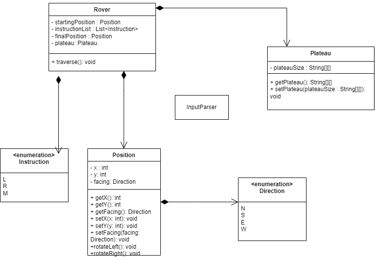

# Mars Rover

## Project Description
Mars Rover is a Java application that simulates the movement of a rover on a plateau on Mars. 
The rover navigates the plateau based on a series of commands, allowing it to explore.

### Requirements

- Java Runtime Environment (JRE) 8 or higher
- 
#### Install instructions

1. Extract the `MarsRoverDist` directory from the zip file.
2. Navigate to the `MarsRoverDist` directory.

#### Running the Application
Open a command prompt and run:
./bin/launch.sh

## Project Documentation

#### UML Diagram

